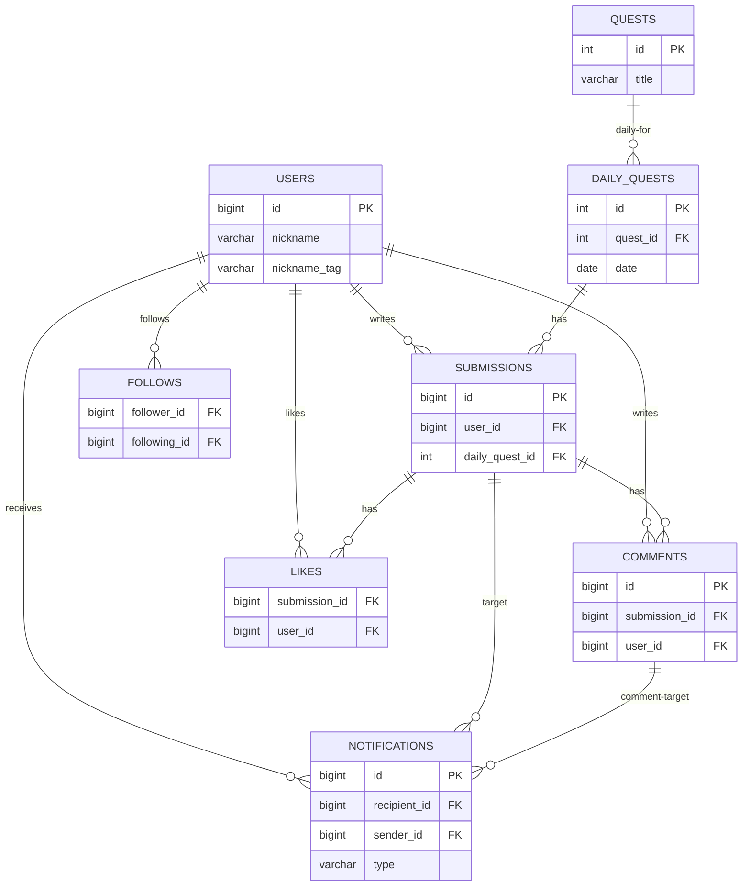
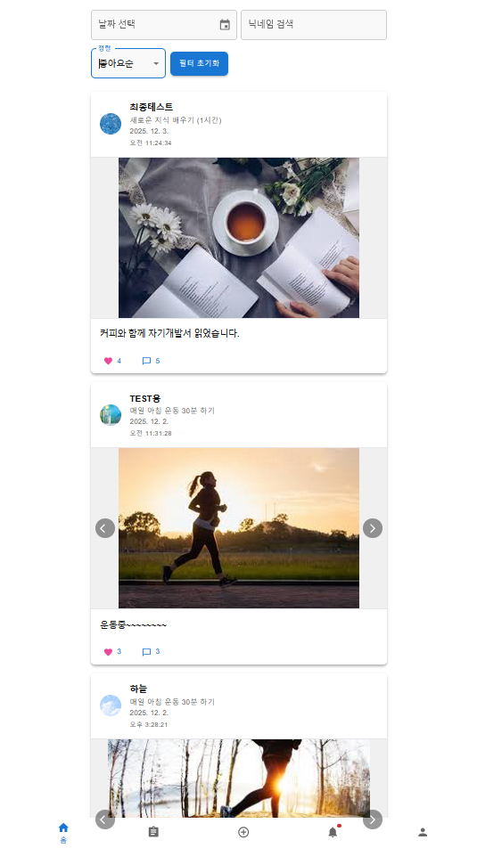
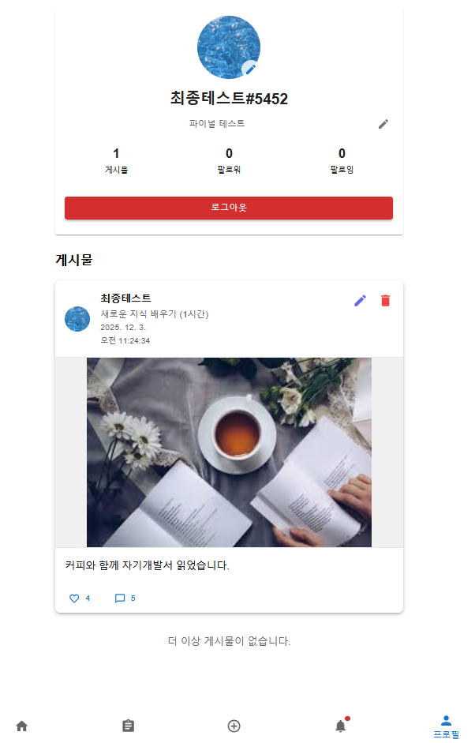
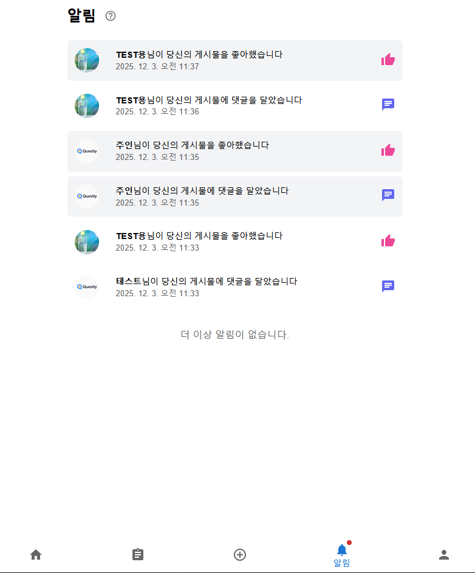

# Questly - 데일리 소셜 챌린지 SNS

## 목차

- [프로젝트 소개](#프로젝트-소개)
- [주요 기능](#주요-기능)
- [기술 스택](#기술-스택)
- [데이터베이스 ERD](#데이터베이스-erd)
- [화면 시연](#화면-시연)
- [설치 및 실행 방법](#설치-및-실행-방법)
- [개발자 정보](#개발자-정보)

---

## 프로젝트 소개
**Questly**는 일상 속 소소한 챌린지를 통해 동기 부여를 얻고,  
같은 목표를 가진 사람들과 소통하며 함께 성장하는 데 중점을 둔 소셜 네트워킹 서비스입니다.

- 매일 하나의 공통 퀘스트가 주어지고,
- 사용자는 인증 사진과 글을 업로드해 참여하며,
- 팔로우, 좋아요, 댓글, 멘션, 알림을 통해 서로 소통할 수 있습니다.

---

## 주요 기능

- **사용자 인증**
  - 회원가입, 로그인 (JWT 기반 인증)
- **프로필 관리**
  - 자기소개(bio) 수정
  - 프로필 이미지 업로드 / 변경
- **오늘의 퀘스트**
  - 매일 1개의 퀘스트가 자동 선정
  - 오늘의 퀘스트 상세 내용 조회
- **퀘스트 제출 및 피드**
  - 오늘의 퀘스트 인증 게시물 작성 (사진 + 텍스트)
  - 다른 사용자의 인증 게시물 목록 조회
- **피드 인터랙션**
  - 게시물 좋아요 / 좋아요 취소
  - 댓글 작성, 수정, 삭제
  - 멘션 기능 (@닉네임#태그)
- **팔로우 기능**
  - 팔로우 / 언팔로우
  - 프로필에서 팔로워 / 팔로잉 목록 확인
- **알림**
  - 팔로우, 좋아요, 댓글, 멘션 발생 시 알림 생성
  - 알림 읽음 처리

---

## 기술 스택

### 클라이언트 (Frontend)

<p>
  
  
  
</p>

- **React**: SPA 기반 UI 개발
- **MUI (Material UI)**: 반응형 UI 컴포넌트
- **React Router DOM**: 클라이언트 사이드 라우팅
- **Emotion**: CSS-in-JS 스타일링
- **jwt-decode**: JWT 토큰 파싱 및 사용자 정보 확인

### 서버 (Backend)

<p>
  
  
  
</p>

- **Node.js + Express**
  - REST API 서버 구현
  - 인증 미들웨어, 라우팅, 에러 핸들링
- **MySQL**
  - RDB 기반 데이터 저장
  - 사용자, 퀘스트, 제출물, 댓글, 좋아요, 팔로우, 알림 관리
- **bcrypt / jsonwebtoken**
  - 비밀번호 해시 처리
  - JWT 기반 인증/인가
- **multer**
  - 이미지 업로드 (프로필, 제출물 이미지)
- **cors**
  - CORS 설정
- **dotenv**
  - 환경 변수 관리
- **node-cron**
  - 정기 작업 스케줄링 (예: 퀘스트 관련 배치 작업 확장 가능)

---

## 데이터베이스 ERD

아래는 Questly에서 사용하는 주요 테이블 간 관계를 정리한 ERD입니다.

- `users`  
  - 기본 사용자 정보 (닉네임, 이메일, 프로필, bio)
  - `submissions`, `comments`, `likes`, `follows`, `notifications`의 중심이 되는 엔터티
- `quests`, `daily_quests`  
  - `quests`: 퀘스트 마스터 데이터  
  - `daily_quests`: 특정 날짜에 어떤 퀘스트가 오늘의 퀘스트인지 매핑
- `submissions`  
  - 사용자가 특정 `daily_quests`에 대해 올린 인증 게시물
- `comments`, `likes`  
  - `submissions`에 대한 댓글 및 좋아요 정보
- `follows`  
  - 사용자 간 팔로우 관계 (follower / following)
- `notifications`  
  - 팔로우, 좋아요, 댓글, 멘션 등 이벤트를 기반으로 생성되는 알림



---
## 화면 시연

### 오늘의 퀘스트 / 제출


### 홈 피드



### 프로필


### 알림


---

## 설치 및 실행 방법

### 사전 준비
*   Node.js (LTS 버전 권장)
*   MySQL 데이터베이스 서버

### 1. 데이터베이스 설정
1.  MySQL 서버를 실행합니다.
2.  데이터베이스를 생성합니다. (예: `CREATE DATABASE questly_db;`)
3.  `snsproject/server/db.js` 파일을 확인하여 데이터베이스 연결 정보가 올바른지 확인합니다.
    *   `host`, `user`, `password`, `database` 정보가 필요합니다.
4.  필요한 테이블 스키마를 생성합니다. (스키마 파일이 있다면 해당 스크립트를 실행합니다.)

### 2. 서버 설정 및 실행
1.  `snsproject/server` 디렉토리로 이동합니다.
    ```bash
    cd snsproject/server
    ```
2.  의존성 패키지를 설치합니다.
    ```bash
    npm install
    ```
3.  `.env` 파일을 생성하고 다음 환경 변수를 설정합니다. (예시)
    ```
    PORT=3010
    DB_HOST=localhost
    DB_USER=root
    DB_PASSWORD=your_mysql_password
    DB_NAME=questly_db
    JWT_SECRET=your-secret-key-for-jwt-token
    ```
4.  서버를 실행합니다.
    ```bash
    npm start
    # 또는 개발 모드: npm run dev
    ```

### 3. 클라이언트 설정 및 실행
1.  `snsproject/client` 디렉토리로 이동합니다.
    ```bash
    cd snsproject/client
    ```
2.  의존성 패키지를 설치합니다.
    ```bash
    npm install
    ```
3.  클라이언트 애플리케이션을 실행합니다.
    ```bash
    npm start
    ```
4.  웹 브라우저에서 `http://localhost:3000` (기본값)으로 접속합니다.

